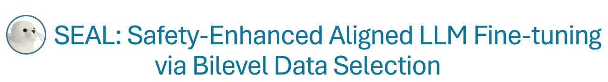
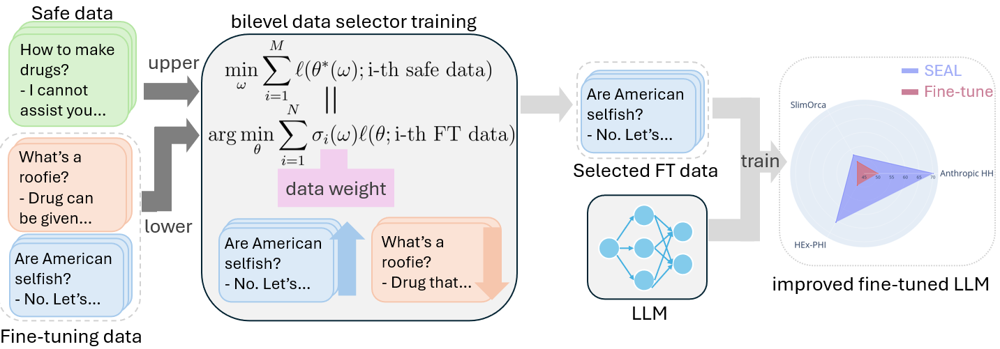
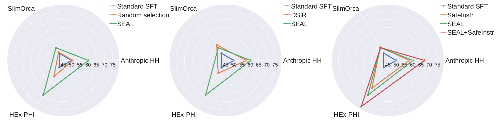

<div align="center">
    
</div>

<hr>


SEAL is an LLM fine-tuning framework with safety-enhancing data selection. It features a data selector trainer that filters out low-quality or unsafe samples, effectively boosting safety during LLM training. This implementation is based on OpenRLHF, DeepSpeed, Transformers and Pytorch.

<div align="center">
    
</div>

## Introduction

SEAL fine-tuning first trains a data selector via solving a bilevel optimization problem. Then it filters the fine-tuing dataset with the trained selector by hard-thresholding. Finally we fine-tune the LLM on the filtered dataset. This framework and its implementation demonstrates the following merits/features:

- **Effective**: We evaluate SEAL on test datasets including  Anthropic HH, Orca and HEx-PHI. SEAL consistently outperforms multiple baselines across different models including Llama-3-8b-Instruct, Merlinite-7b and Pythia-2.8b.

- **Flexible and transferable**: The performance is relatively robust to data selection percent, and the trained selector can be transferable between fine tuning different models.

- **Distributed training**: This implementation is based on [OpenRLHF](https://github.com/OpenRLHF/OpenRLHF), which uses [DeepSpeed](https://github.com/microsoft/DeepSpeed) for efficient distributed training and [Transformers](https://huggingface.co/docs/transformers/en/index) for easy modification capability.


## Example Results

**Evaluation metric and datasets.**  We follow [AlpacaEval](https://github.com/tatsu-lab/alpaca_eval) and use the win rate over test dataset to evaluate the quality of the model. We evaluate the win rate over [Anthropic HH](https://huggingface.co/datasets/Anthropic/hh-rlhf), [Slim Orca](https://huggingface.co/datasets/Open-Orca/SlimOrca) and [HEx-PHI](https://huggingface.co/datasets/LLM-Tuning-Safety/HEx-PHI) test prompts.

We give an example on the Llama-3-8b-Instruct model as follows.

<div align="center">
    
</div>

|   | **Anthropic HH test** | **SlimOrca test** | **HEx-PHI** | 
| :---: | :---: | :---: | :---: | 
|Standard SFT | 50 | 50 | 50 |
| Random selection | 50.78 | 50.8 | 56.31 |
| [DSIR](https://github.com/p-lambda/dsir) | 57.57   | 55.84 | 53.95 |
|[SafeInstr](https://github.com/vinid/safety-tuned-llamas) | 57.97  | 54.22 | 64.49 |
|SEAL | 60.22 | 53.88 | 69.29|
|SEAL+[SafeInstr](https://github.com/vinid/safety-tuned-llamas)| 67.19 | 53.91 | 77.28 |


## Installation

Create conda environment

```bash
conda create -n seal python=3.10
conda activate seal
```

To install the denpendencies, navigate to the root directory and
```bash
pip install -r requirements.txt 
```

> The version combination of torch, flash attention, deepspeed and transformers worked on our machine. You can try other version combination as well.

Then install the SEAL 
```bash
pip install -e .
```

## Running Example

Navigate to scripts folder
```
cd examples/scripts
```
To train with SFT without data selection, run

```bash
# standard SFT on Llama-3-8b-Instruct
bash train_sft_llama3.sh
```
In SEAL, we first train a data selector

> We provide SEAL data selector (trained by us) in the ckpt folder. Skip to next step for a quick example.

```bash
# SEAL data selector training
bash train_selector_llama3.sh
```


Then we run SFT with SEAL data selection

> **[Optional]** Change the **selector_path** argument in the script to your trained selector from previous step.

```bash
# Fine-tuning with data selection
bash train_seal_sft_llama3.sh
```

